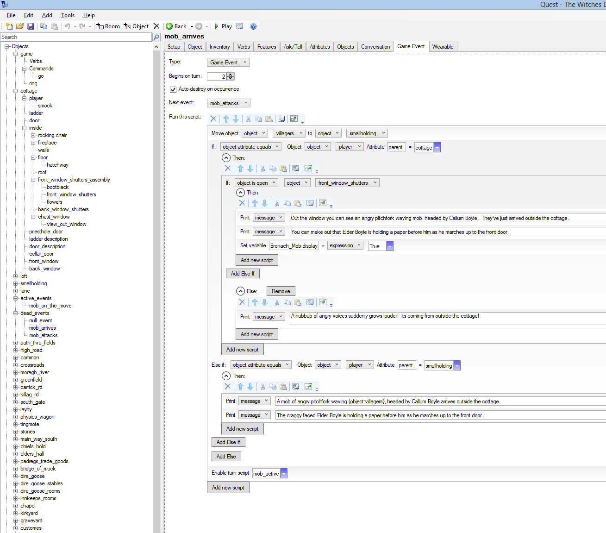

# QuestGameEvents

GameEvents library in aslx for [Quest](http://textadventures.co.uk/quest)

There's a great page in the documentation about [turn based events](http://docs.textadventures.co.uk/quest/guides/turn_based_events.html).

Here's a library with tabs to support that.

## To Use It

Check the section under [using libraries](http://docs.textadventures.co.uk/quest/tutorial/using_libraries.html) in the Quest documentation to add the library to your Quest game.  Basically just choose _Add_ > _Library_ from the menu, then click the _Browse_ button to navigate to the `GameEvents.aslx` file.  Once loaded you still need to do some setup in your game:

1.  Create two rooms "dead_events" and "active_events" with no exits into or out of them
2.  Add an integer attribute called "turn" to your main game object, set it to 0

## To Create events

Create events that you want to happen without special prompting in "active_events" by

* right-click, new object > change drop-down under "Type" from "None" to "Game Event"
* set the number of turns after the game starts that you want the event to occur
* add a script to implement the behaviour of the event or text to print
* check "auto destroy" if you only want the event script to run once

As soon as the game reaches the `turn` value, the event will run.

## The 'auto' and 'done' flags

When the `auto` flag is set, by checking the box marked "Auto-destroy on occurrence" in
the UI tab for example, after an event is run, it will automatically be unscheduled,
AND its `done` flag will be set to true.  If `auto` is false, then the event will just
keep occurring every turn.  If `auto` is false then you probably want to use some
script to disable the event, for example have another event `UnscheduleGameEvent`.

The `done` flag effectively disables an event when set.  The `StageEvent` function which is
responsible for making an event occur, will do nothing if `done` is set on an event.

## Have Events Run After a Previous Event

Create events that you want to happen contingent on previous events under "dead_events"

* right-click, new object > change drop-down under "Type" from "None" to "Game Event"
* set the number of turns after being triggered that it should start
* add a script
* check "auto destroy" if needed
* trigger it by:
    * find an event in 2) above and the name of this event to its _Next event:_ list OR
    * write a script that uses one of the functions below

When your event is scheduled as a "next event", the "turns" setting is the number of turns after being scheduled that it runs. Of course if you want it to run immediately after its pre-cursor event triggers it you can just make its "turns" equal to 1 or 0.

## Child Events: Run Parts of Events Only When Player is in a Room

Often you want an event to *behave differently* depending on what room the player is in.  Events are effectively global, but you may want to print different messages if the player is in different places.  

* To do this create an event and place it in the given room.  This will be a child of your main event.
* Name your child event with the same name as the parent event but with a distinguishing suffix, eg the room name.
* Otherwise configure it as for normal events

When the events run, first your main event will run, and then any room events.  So for example if you have an event `balloon_rises`, you could have a `balloon_rises_garden` in the room called `garden`.  First `balloon_rises` would be run, then `balloon_rises_garden` if the player is in the garden.  

## Room Events: Run Events Only for a Specific Room

Often you want an event to only occur if the player is in a specific room.

Place an event with the name "EVENT_something" in a room to have it executed *only when* the player
is in that room.  If you want to have an event that behaves differently for a specific room but
which happens no matter what room the player is in, use a *child event* instead.

If the `turn`attribute on the event is -1 then it will execute straight away.  Otherwise it will occur
just like other events when the player is in that room, AND the `game.turn` counter is
greater than or equal to the event turn.  Note that `auto` and `done` behave the same as usual.

Child events do not run for a Room Event.

## Use Events from Scripts

There are 3 functions you can use:

    ScheduleGameEvent(some_event)

The event will occur, assuming `done` is false, after some_event.turn turns have passed. (It's moved to active_events)

----

    UnscheduleGameEvent(another_event)

The event will not occur. (It's moved to dead_events).  The `done` flag is not changed.

----

    StageEvent(super_event)

If `done` is true, does nothing. If `done` is false the event immediately occurs. Its script is run and its done flag is set true.

----

Note that after an event occurs the done flag is set. Under the hood, StageEvent is used to make events occur. You can test this flag to see if an event has been completed or not.

    if (not balloon_inflating.done) {
        msg ("I shall use my inflate-o-matic!")
    }

If you call ScheduleEvent on an event it will not alter the done flag. If done is true, the event will be moved to active_events but it will never occur. If you want an event to occur, but somehow done is set, then manually set it to false before calling ScheduleEvent. UnscheduleGameEvent likewise does not alter the done flag.

## Why couldn't you make the library automatically add the rooms and so on?

I know steps 1 - 3 above are a pain. But there's no way to be sure that someone hadn't already got a dead_events or game.turn. Hopefully the sample game makes it clear.

It's most likely riddled with bugs: I'll see how excited I am about fixing them, but let me know.
